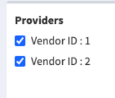
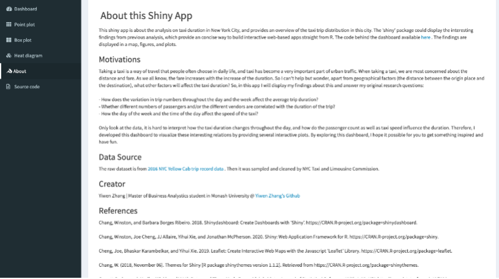

# Shiny dashboard : Analysis on Taxi Duration in NYC


### Creator & Author : Yiwen Zhang

This is the shiny dashborad for analysis on taxi duration in NYC, hope you can enjoy your exlporation.
And if there is any error, please feel free to write a github issue. 

Thank you and have fun !

## User guide

### Installation of packages

```r
install.packages(c(“tidyverse”, “plotly”, “shiny”, “shinydashboard”, “ggplot2”, “scales”, “grid”, “corrplot”, “alluvial”, “dplyr”, “readr”, “data.table”, “tibble”, “tidyr”, “stringr”, “forcats”, “lubridate”, “geosphere”, “leaflet”, “maps”, “shinythemes”, “bookdown”))
```
_It should be noted that in order to make “wday” function work normally, please load package **data.table** first and then load package **lubridate**_ :)

### Launch the app

``` r
Run App
```

### Shiny Application User Interface

#### Main page

Once you have launched this app, it comes to the main page as below.


You can click the dropdown menus to get contact with creator by email or get support from Gihub. Also, you can zoom in or zoom out to view this distribution map in detail.

   

And if you want to hide the navigation bar, please just click the button in header, just next to the title.


#### Subpage 1 point plot

Let’s explore the first subpage. You can select the provider by clicking the button inside the box. You can select one only or two at the same time.


When you select only one, the figure is like the left below, and when select two, it is like the right one below. Both bar chart and dotted line chart can be controlled by your selection.

   


   

Also, you can manually set the time range or just click the triangle button, the time slider will move on automatically, and the figures will change with it as well.


#### Subpage 2 box plot

Then let’s move to the next page, it’s the boxplot to show how variation in passenger count affect the duration. You can select the number of passengers from the dropdown list from 0 to 9 to get different outputs of the boxplot as below.


#### Subpage 3 Heat diagram

The last page about figures is Heat diagram. When you mouse over the diagram, the information of each value will show.


And if you want to change the type of the right-side regression curve, just click the button beneath it named “Point plot”, then a scatterplot will replace it to display.


#### About page

The last page is the About page to identify the creator and contain the introduction as well as the references.



You can click the link to access to the data source or go to the creator’s Github page.


*This is all about the guide of exploration in this app. Due to the large amount of data, the display of graphs will be a little slow, please wait for a while when changing to a different page. I have tried my best to improve the running speed by processing the data. Sorry for the inconvenience. Hope you can get something inspired and have fun!*

## Reference

The dataset in this package is from:

  - \[alluvial\]<https://github.com/mbojan/alluvial>
  - \[World Health
    Organization\]<https://www.who.int/emergencies/diseases/novel-coronavirus-2019>
  - \[COVID19 Daily
    Updates\]<https://www.kaggle.com/gpreda/coronavirus-2019ncov>

